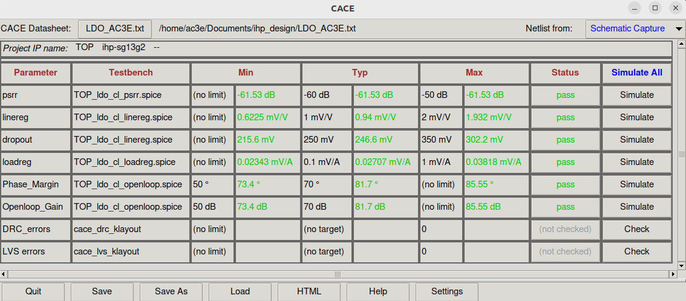
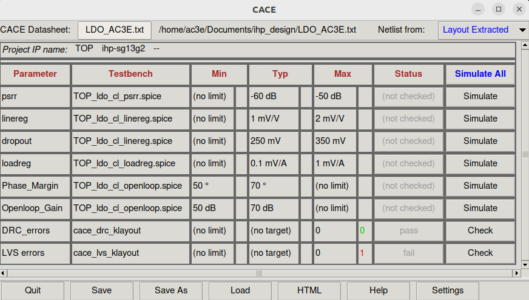

.. _CACE_simulations:

CACE
=====

Runing CACE gui
------------

In order to initialize the CACE gui with the specifications file made for this proyect yo should just run this command in the design's folder:

.. code-block:: console

   (.venv) $ make cace

Then by pressing the top right button of the table 'Simulate All' all the electrical parameters simulations will be triggered.

To run the DRC and LVS (physical parameters) you should change the "Netlist from:" from "Schematic Capture" to "Layout Extracted" that is on the top right of the CACE window. Then DRC and LVS can be run nomrally.

HTML datasheet generation
----------------

__ ../TOP.html

To retrieve a list of random ingredients,
you can use the ``lumache.get_random_ingredients()`` function:

.. autofunction:: lumache.get_random_ingredients

The ``kind`` parameter should be either ``"meat"``, ``"fish"``,
or ``"veggies"``. Otherwise, :py:func:`lumache.get_random_ingredients`
will raise an exception.

.. autoexception:: lumache.InvalidKindError

For example:

>>> import lumache
>>> lumache.get_random_ingredients()
['shells', 'gorgonzola', 'parsley']

