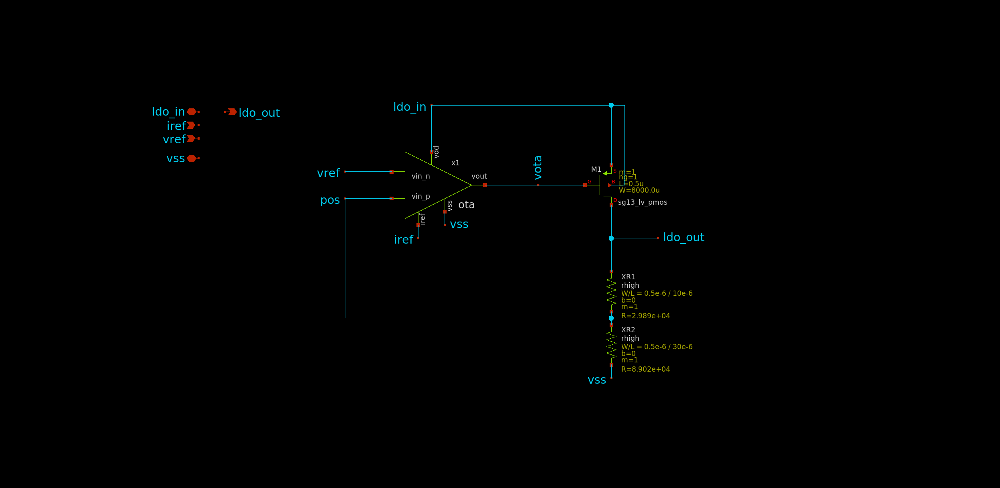

.. _LDO_design:

LDO Design
==========

Overview
------------

The LDO module in the `LDO_AC3E` repository provides a low-dropout voltage regulator designed to maintain a stable output voltage despite fluctuations in the input voltage.

Parameters

1. Dropout Voltage: The minimum voltage difference between the input and output required for the LDO to operate properly.
2. PSRR (Power Supply Rejection Ratio): The ratio of change in output voltage to change in input voltage, indicating how well the LDO rejects changes in the input voltage.
3. Quiescent Current: The current consumed by the LDO when there is no load.
4. Line Regulation: The ability of the LDO to maintain a constant output voltage despite changes in the input voltage.
5. Load Regulation: The ability of the LDO to maintain a constant output voltage despite changes in the load current.
6. Phase Margin: The difference in phase between the LDO's output and input signals at the unity gain frequency, indicating stability.
7. Open-Loop Gain: The gain of the LDO without feedback, often characterized in dB or decibels.

Topology
------------

The Low Dropout Regulator (LDO) in use employs an :ref:`operational transconductance amplifier <OTA_design>`  (OTA) in conjunction with a PMOS pass transistor. The OTA compares a reference voltage with the output voltage feedback, generating an error signal to control the conductance of the pass transistor. This setup maintains a stable output voltage despite input voltage variations, making it ideal for low-power applications.

.. _ldo_closeloop:

  
  LDO Topology
  
Aimed Specifications
------------

+---------------------------+-------+
| Parameter                 | Value |
+===========================+=======+
| Dropout Voltage (mV)      | <250  |
+---------------------------+-------+
| Line Regulation (mV/V)    | <1    |
+---------------------------+-------+
| Load Regulation (mV/mA)   | <0.01 |
+---------------------------+-------+
| Quiscient Current (uA)    | <55   |
+---------------------------+-------+
| Maximum current load (mA) | 100   |
+---------------------------+-------+
| Phase Margin              | >60*  |
+---------------------------+-------+
