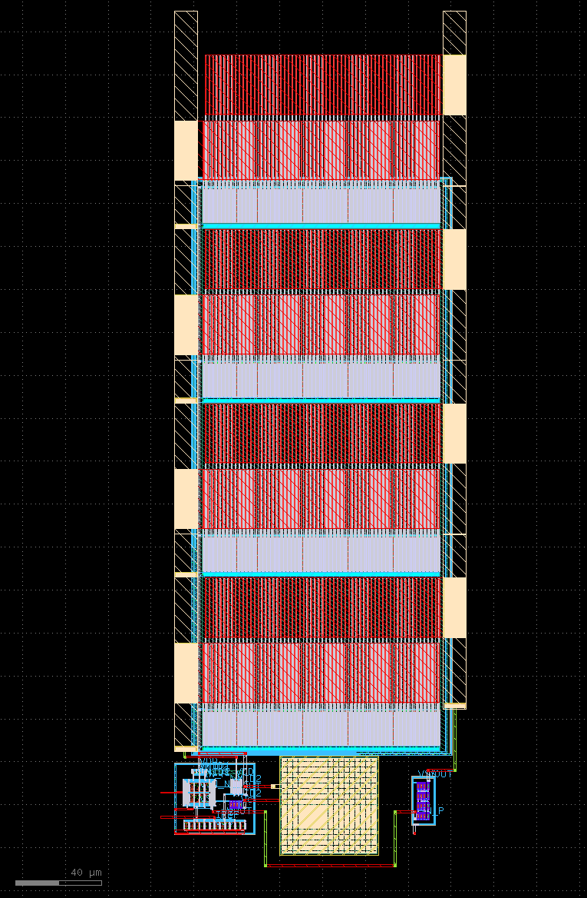

.. _LDO_layout:

LDO Layout
==========

Overview
------------

The LDO layout has a total size of 137μm x 399μm. Most of the area is occupied by the pass transistor, which uses roughly 87% of the space.

The :ref:`LDO_layout_fig` figure was taken from KLayout.

.. _LDO_layout_fig:

  LDO Layout