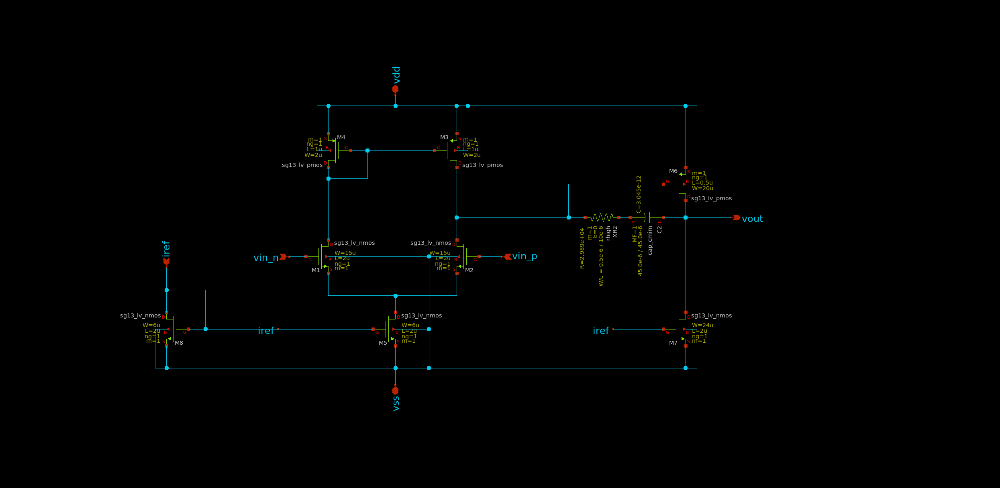

.. _OTA_design:

OTA Design
==========

Overview
------------

The Two-Stage Operational Transconductance Amplifier (OTA) module in the `LDO_AC3E` repository offers a critical component designed to amplify the error signal in the feedback loop of the LDO. It is engineered to enhance stability and performance by effectively regulating the output voltage.

Parameters:

1. Gain (Av): The amplification factor of the OTA, representing the ratio of output current to input voltage.
2. Bandwidth (BW): The range of frequencies over which the OTA can effectively amplify signals.
3. Power Consumption: The amount of power consumed by the OTA during operation.

Topology
------------

The two-stage Operational Transconductance Amplifier (OTA) features a differential input stage and a single-ended output stage. This topology enables high gain and wide bandwidth, making it suitable for various analog applications.

.. _miller_ota:

  
  2-stage miller OTA
  
Aimed Specifications
------------

+-----------------------+-------+
| Parameter             | Value |
+=======================+=======+
| Gain (dB)             | >60   |
+-----------------------+-------+
| GBW (MHz)             | >10   |
+-----------------------+-------+
| Power Consumption (uA)| <100  |
+-----------------------+-------+