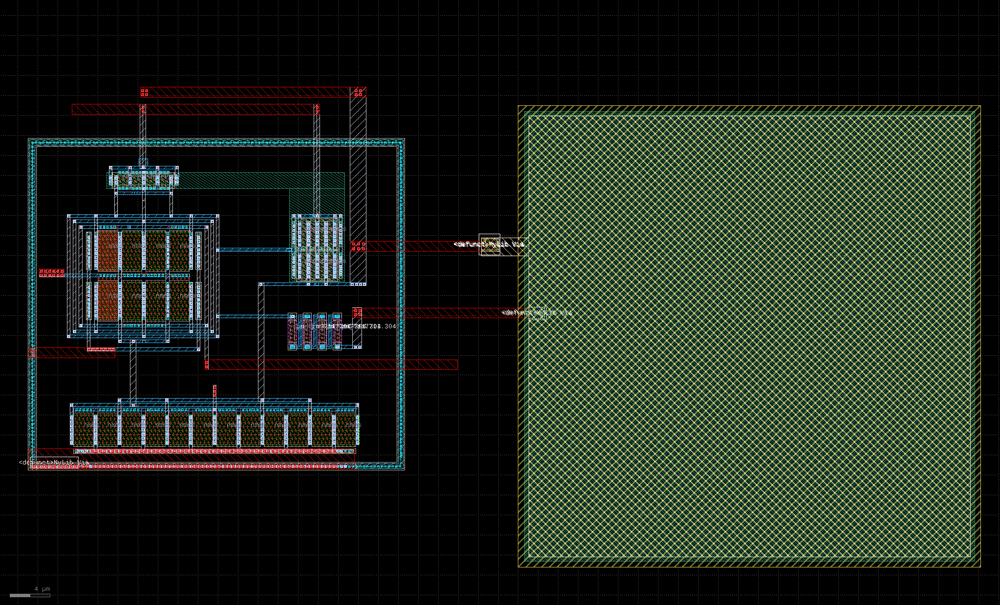

.. _OTA_layout:

OTA Layout
==========

Overview
------------

The OTA layout has a total size of 95μm x 49μm. Most of the area is occupied by the miller capacitor, which uses roughly 48% of the space.

The :ref:`OTA_layout_fig` figure was taken from KLayout.

.. _OTA_layout_fig:

  OTA Layout