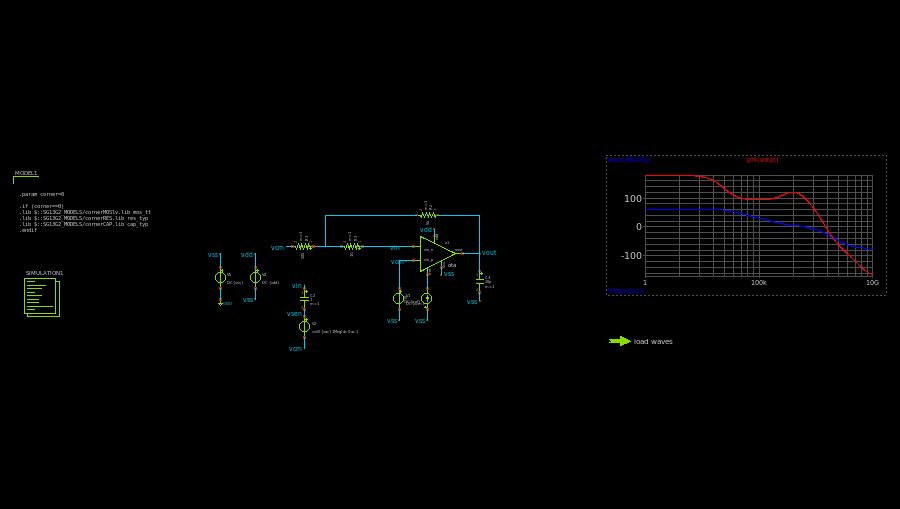
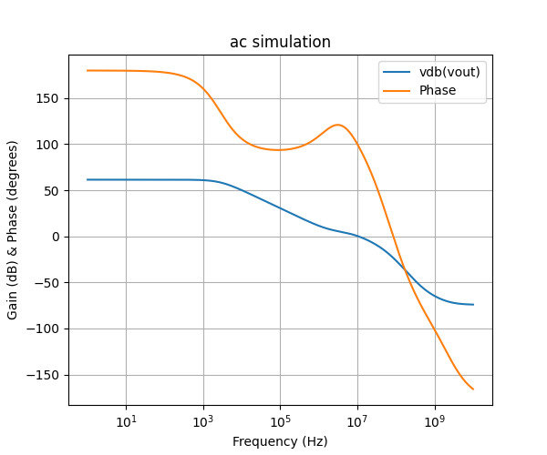

.. _OTA_simulation:

OTA Simulation
==========

Overview
------------

This section provides documentation for running simulations on the OTA design to evaluate its performance characteristics such as Gain and GBW. A Python script is used to automate the simulations and generate relevant figures.

To run the Python script, navigate to the folder containing the schematic testbench files and use the following command in your terminal:

.. code-block:: sh

    python3 run.py

Open-Loop Simulations
------------

  OTA open-loop simulation schematic

The open-loop simulations performed on the OTA design include:

- **AC Simulation**: Used to extract the Gain and GBW.

The following figure illustrates the results of the simulations:

  OTA open-loop simulation