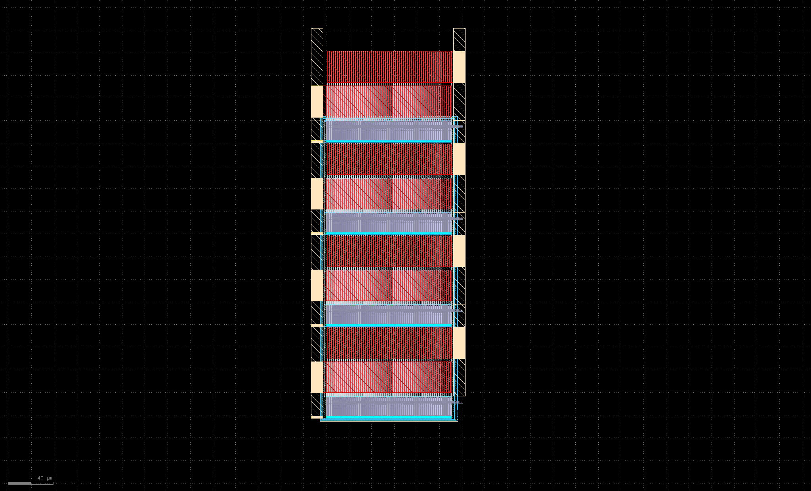

.. _Pass_transistor_layout:

Pass transistor Layout
==========

Overview
------------

The Pass transistor layout has a total size of 136μm x 347μm.

The :ref:`Pass_transistor_layout_fig` figure was taken from KLayout.

.. _Pass_transistor_layout_fig:

  Pass transistor Layout