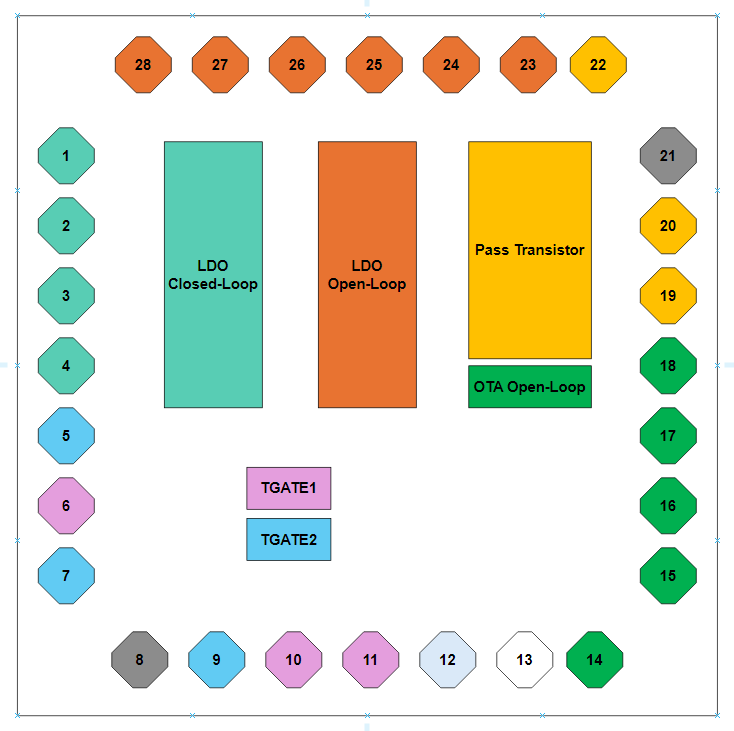

.. _TOP_design:

TOP Design
==========

Overview
------------

The figure :ref:`TOP floorplan <TOP_floorplan>` displays the distribution of the designs on the TOP GDS. The chip features 28 pins, with only one (pad 13) remaining unused. All of them, except for the ground pin, are equipped with ESD protection.

.. _TOP_floorplan:

  TOP floorplan

The next table show Below is a table listing all the pin names and their corresponding descriptions for the various designs in the chip:

.. _TOP_table:

+------------+--------------+--------------+----------------------------------------+
| Pin Number | Pin Name     | Type         | Description                            |
+============+==============+==============+========================================+
| 1          | Vout_ldo_cl  | Analog       | LDO Closed-Loop design output          |
+------------+--------------+--------------+----------------------------------------+
| 2          | Vin_ldo_cl   | Power Supply | LDO Closed-Loop design Input voltage   |
+------------+--------------+--------------+----------------------------------------+
| 3          | Vref_ldo_cl  | Analog       | LDO Closed-Loop design Voltage ref     |
+------------+--------------+--------------+----------------------------------------+
| 4          | ibias_ldo_cl | Analog       | LDO Closed-Loop design ibias current   |
+------------+--------------+--------------+----------------------------------------+
| 5          | TGATE1_IN    | Analog       | Tgate1 input                           |
+------------+--------------+--------------+----------------------------------------+
| 6          | TGATE2_IN    | Analog       | Tgate2 input                           |
+------------+--------------+--------------+----------------------------------------+
| 7          | TGATE1_EN    | Digital      | Tgate1 enable                          |
+------------+--------------+--------------+----------------------------------------+
| 8          | Vss          | Power Supply | Global Ground                          |
+------------+--------------+--------------+----------------------------------------+
| 9          | TGATE1_OUT   | Analog       | Tgate1 output                          |
+------------+--------------+--------------+----------------------------------------+
| 10         | TGATE2_OUT   | Analog       | Tgate2 output                          |
+------------+--------------+--------------+----------------------------------------+
| 11         | TGATE2_EN    | Digital      | Tgate2 enable                          |
+------------+--------------+--------------+----------------------------------------+
| 12         | TGATE_VDD    | Power Supply | Tgate1 and Tgate2 power supply         |
+------------+--------------+--------------+----------------------------------------+
| 13         | NOT USED     |              |                                        |
+------------+--------------+--------------+----------------------------------------+
| 14         | vdd_ota      | Power Supply | OTA power supply                       |
+------------+--------------+--------------+----------------------------------------+
| 15         | ibias_ota    | Analog       | OTA bias current                       |
+------------+--------------+--------------+----------------------------------------+
| 16         | in_pos_ota   | Analog       | OTA positive input                     |
+------------+--------------+--------------+----------------------------------------+
| 17         | out_ota      | Analog       | OTA output                             |
+------------+--------------+--------------+----------------------------------------+
| 18         | in_neg_ota   | Analog       | OTA negative input                     |
+------------+--------------+--------------+----------------------------------------+
| 19         | Vgate_pt     | Analog       | Pass Transistor Gate                   |
+------------+--------------+--------------+----------------------------------------+
| 20         | Vdrain_pt    | Analog       | Pass Transistor Drain                  |
+------------+--------------+--------------+----------------------------------------+
| 21         | Vss          | Power Supply | Global Ground                          |
+------------+--------------+--------------+----------------------------------------+
| 22         | Vsource_ota  |              | Pass Transistor source                 |
+------------+--------------+--------------+----------------------------------------+
| 23         | vdiv_ldo_ol  | Analog       | LDO Open-Loop voltage divider output   |
+------------+--------------+--------------+----------------------------------------+
| 24         | pos_ldo_ol   | Analog       | LDO Open-Loop positive input           |
+------------+--------------+--------------+----------------------------------------+
| 25         | Vout_ldo_ol  | Analog       | LDO Open-Loop output voltage           |
+------------+--------------+--------------+----------------------------------------+
| 26         | ibias_ldo_ol | Analog       | LDO Open-Loop bias current             |
+------------+--------------+--------------+----------------------------------------+
| 27         | vref_ldo_ol  | Analog       | LDO Open-Loop voltage reference        |
+------------+--------------+--------------+----------------------------------------+
| 28         | Vin_ldo_ol   | Power Supply | LDO Open-Loop power supply             |
+------------+--------------+--------------+----------------------------------------+

