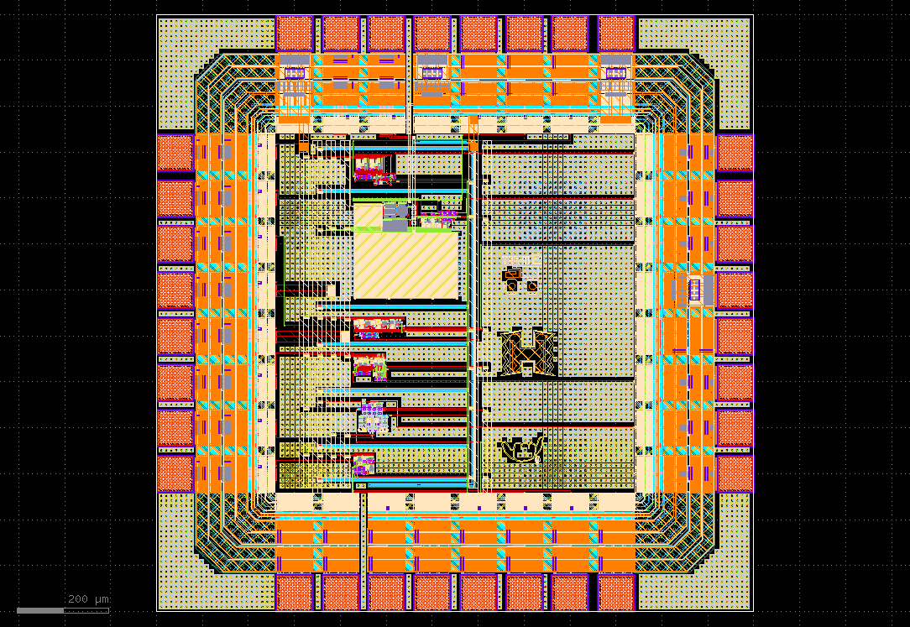

# Chip Design for IHP SG13G2 Tapeout (May 2024)

EE 628 (University of Hawaiʻi at Mānoa)  
https://github.com/bmurmann/EE628

This chip contains six copies of an incremental delta-sigma modulator (one of them is powered by an an LDO). The chip dimensions are 1300 x 1300 (without seal ring).

