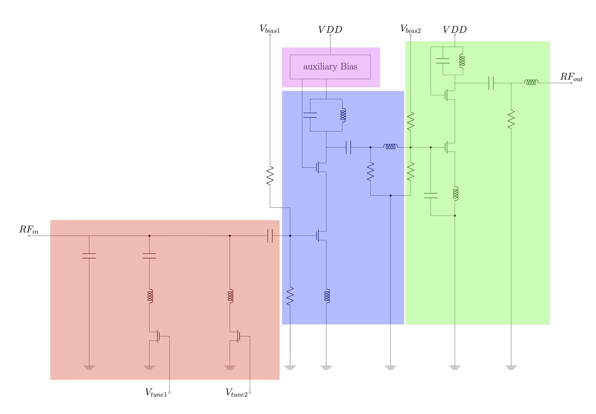
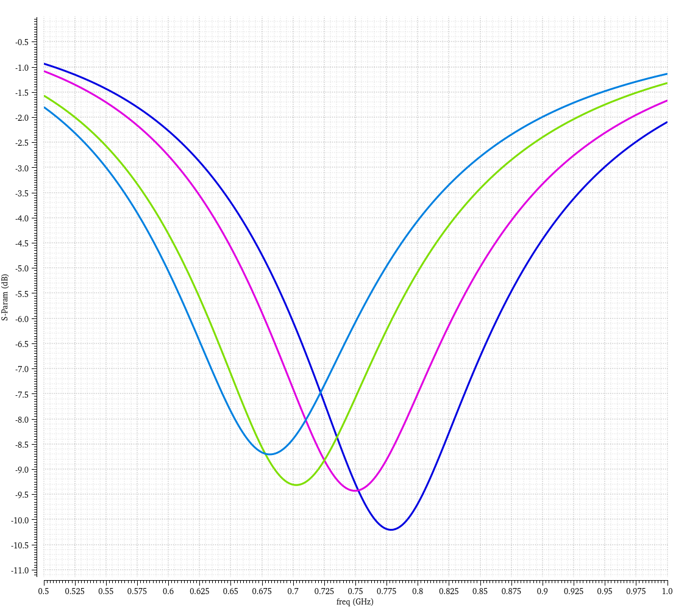
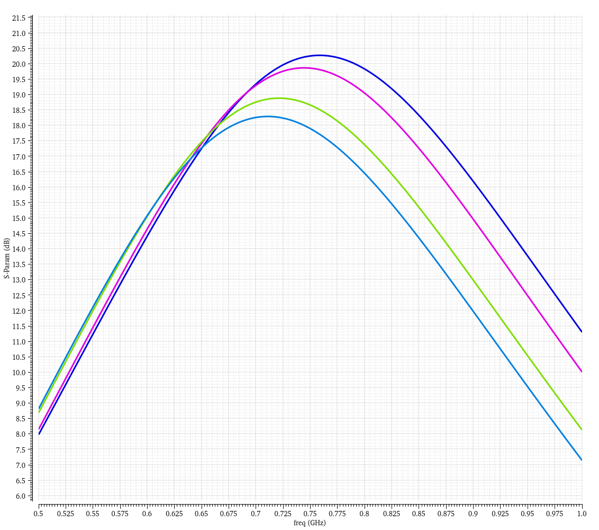
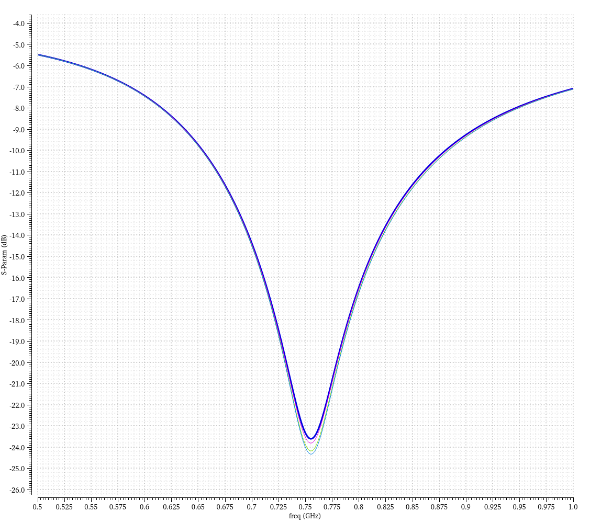
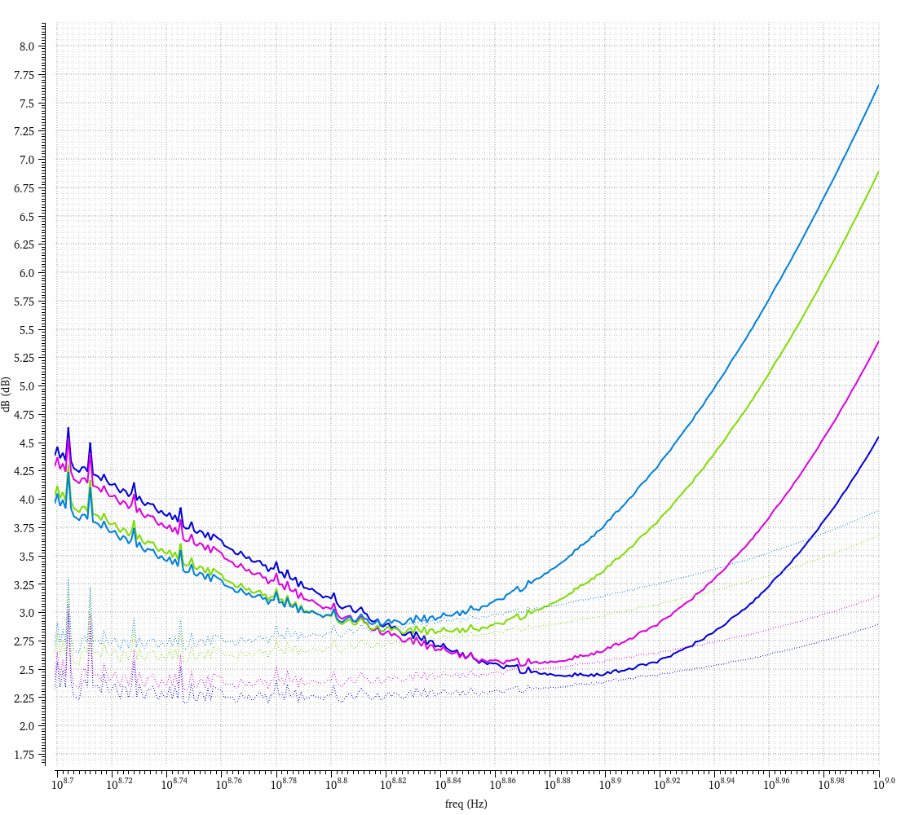

# Open Source: CMOS-LNA in SG13G2 technology

### Alexander Spielberger, Christof Pfannenmüller; Institute for Electronics Engineering; Friedrich-Alexander-Universität Erlangen-Nürnberg (FAU) 

In this project, a low-noise receiver amplifier was designed for a frequency range from 650 MHz to 825 MHz. The design should be usable for cellular handheld devices and support various LTE bands.

##Specifications
The project specifications result in the following requirements for the LNA, designed for the LTE mobile radio standard:

| Parameter        | Specs LNA   |
|------------------|-------------|
| Frequency Range  | 0.6 - 1 GHz |
| Gain (min.)      | 17 dB       |
| NF (max.)        | 1.0 dB      |
| 1 dB Comp. Point | -14 dBm     |
| VDD (nom.)       | 1.2 V       |
| Current (nom.)   | 9 mA        |

## Circuit diagram

The amplifier consists of two cascode common-source stages. 
The input of the amplifier can be adjusted for different frequency bands via a switchable matching network (red).

This is followed by the first stage (blue). The operating point is set using two resistors and a separate control voltage. The output of this cascode circuit is matched to the second stage using a capacitor and an inductor.
The amplifier stage is stabilized with a resistor at the output to ground.

This is followed by the second amplifier stage (green). Its operating point is also set via two resistors and its own control voltage.
The output of this cascode circuit is adjusted with a capacitor and an inductor. The stage is also stabilized via a resistor to ground.

An auxiliary circuit (purple) is connected to the first amplifier stage to regulate the operating point.

## Simulation results

The amplifier was simulated from 500 MHz to 1000 MHz.
Each simulation was done for all possible combinations of tuning voltages, as shown in the table below.

|					| V_tune_1  |V_tune_2|
|------------------|-------------|-------------|
| dark blue  | 0 V |0 V|
| purple      | 0 V       |1.8 V  |
| green       | 1.8 V     |0 V|
| light blue | 1.8 V     |1.8 V|

### Input matching S11:
The input matching of the designed LNA is highly dependent on the tuning voltages described above. This helps to provide optimum input matching for the current band the LNA is working at.

### Gain S21:
Like the input matching, the gain varies over the four possible tuning voltages. Therefore, the maximum gain of the LNA is always in the middle of the current band the LNA is operating at. 

### Output adjustment S22:
As shown in the figure below, the LNA's output matching is only slightly affected by the two tuning voltages.

### Noise Figure NF_min:
The following plot shows the noise figure of the designed LNA. The NF_min is plotted with dashed lines, and the NF is plotted in solid lines.

