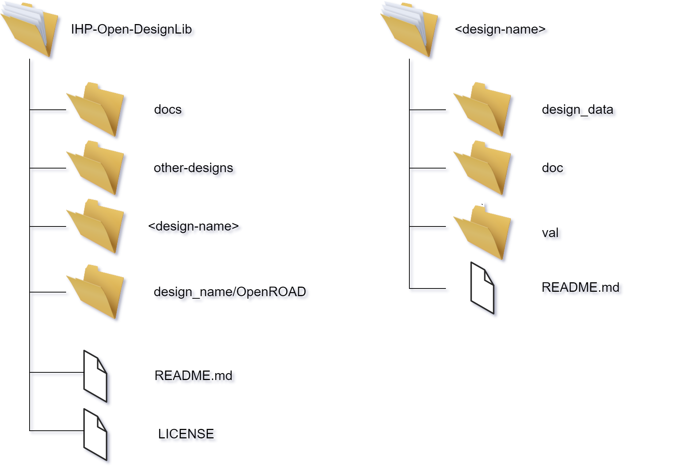

Files and directories
========================

After successful cloning of the  **IHP-Open-DesignLib** respository you should copy the ``riscv32i`` directory in order to conserve
the directory structure. You can do it executing:

.. code-block:: console

  cp -R riscv32i your_design

The directory structure should look like on the following graphics (right image)

The internal structure of the ``your_design`` is presented on the figure below

1. If you use ``OpenROAD-flow-scripts`` just copy and paste the files from your local ORFS installation to the respective directories conserving the directory structures.

2. Use ``doc/`` directory for respective documentation (md, rst) formats are recommended. It is recommended to document here the initial specification and the measurement results. 

3. Use ``design_data`` to store your design related data like: schematic entries, gds files, netlists, configuration files, lef and liberty views. Try to keep the design data in a separate folders. 

4. Use ``val`` to provide validation data like: test benches, raw simulaton results, sign-off reports, DRC and LVS reports. Try to keep the above mentioned data separated.    

  

  .. autosummary::
   :toctree: generated
  

