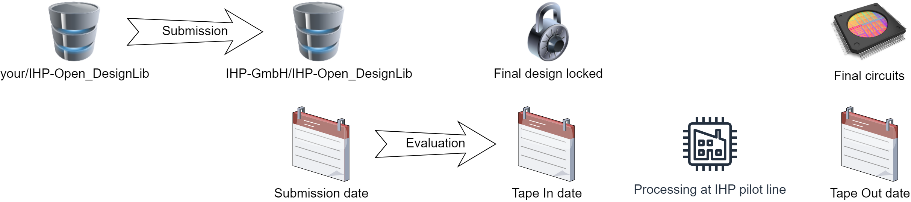

Welcome to IHP-Open-DesignLib documentation!
###################################################

**IHP-Open-DesignLib**  is repository, which contains open source IC designs using IHP SG13G2 BiCMOS processs.
It is also a central point for design fabrication under the concept of IHP Free MPW runs funded by a public German
project `FMD-QNC (16ME083) <https://www.elektronikforschung.de/projekte/fmd-qnc>`_. 
Project funds can be used exclusively to produce chip designs for non-economic activities, such as university education, research projects, and others.
In the project, a continuation for the provision of free area for the open source community is to be worked out.

+-------------------------------+-------------+-------------+-------------+-------------+-------------+-------------+-------------+
|         Tape In date          | 10 May 2024 | 11 Nov 2024 | 22 Nov 2024 | 01 Mar 2025 | 09 May 2025 | 18 Jul 2025 | 15 Sep 2025 |
+===============================+=============+=============+=============+=============+=============+=============+=============+
|          Technology           |   SG13G2    |  SG13CMOS   |   SG13G2    |   SG13G2    |   SG13G2    |   SG13G2    |  SG13CMOS   |
| Area available [mm\ :sup:`2`] |     10      |     220     |     20      |     140     |     30      |     30      |     220     |
+-------------------------------+-------------+-------------+-------------+-------------+-------------+-------------+-------------+

The SG13G2 refers to the full access to the devices availables in the `IHP-Open-PDK`. 
The SG13CMOS is an limited version of the SG13G2, which does not provide access to the HBT devices (High Performance Heterojunction Bipolar Transistors) 

The overview of the submission process is shown on the following figure. 

The submission process contains a few steps, where some of them are mandatory and crucial:  

#.  Project development phase. At the beginning specifications an criteria will be defined by PDK status, later specifications from sponsors might be possible
#.  The community can provide designs intended for prototyping submitting a design via a pull request on an `IHP-Open-DesignLib <https://github.com/IHP-GmbH/IHP-Open-DesignLib>`_ GitHub repository 
#.  Once submitted a series of rejection test will be triggered checking for the completeness and correctness of the design. Usually this process takes a few hours. If the tests report errors the 
    user will get notification in order to fix and resubmit the design. 
#.  All designs, which have passed tests will be submitted for a selection process according to criteria presented below. 
#.  The time window for Evaluation & selection will be around 10 days (it may differ between different shuttles). 
#.  Selected designs will be processed at IHP pilot line facility and then stored in IHP Open Source Sample House. This process takes around 4 months. 
#.  The designer or vitually anyone can rent the sample for joint evaluation for a limited amount of time. The terms and conditions of this procedure are described in this :download:`document <doc/samples.rtf>`
#.  The period of joint evaluation by one person/group is limited to 2 years. The results obtained during this period should be uploaded to the respective repository under `IHP-Open-DesignLib <https://github.com/IHP-GmbH/IHP-Open-DesignLib>`_ GitHub repository.
#.  Depending on the requirements, characterization can be done in scientific collaborations by the open community which may wish to use the designs for development and research projects.

Criteria for selection of designs submitted by open source community:
**************************************************************************
Mandatory criteria for IP selection 
============================================
#. Completeness of IP data. The mandatory criteria is to provide design data together with open source license. 
#. The submitted design should fulfill the DRC (Design Rule Check) criteria.
#. The maximum area below  2 mm\ :sup:`2` preferred (larger designs only if area is available)
#. Potential export restrictions

Additional criteria for IP selection 
==============================================
#. First time submission (preferred)
#. Design should use tools supported by IHP open PDK
#. For SG13G2 Runs designs using SiGe (preferred)
#. Documentation quality
#. Uniqueness, not yet seen designs (i.e. if there were no ADCs before, an ADC design would get a higher point)
#. Area Utilization (designs that make more use of the padframe are preferred)

Check out the :doc:`submission` section for the information on how to submit a new design to the repsitory. 

.. note::

   This project is under active development.

.. include:: toc-submission.rst

.. include:: ../../riscv32i/toc-riscv32i.rst

Contents
--------
