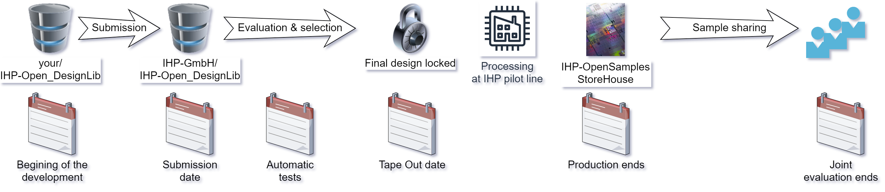

Welcome to IHP-Open-DesignLib documentation!
====================================================

**IHP-Open-DesignLib**  is repository, which contains open source IC design using IHP SG13G2 BiCMOS processs.
It is also a central point for design fabrication under the concept of IHP Free MPW runs funded by a public German
project `FMD-QNC (16ME083) <https://www.elektronikforschung.de/projekte/fmd-qnc>`_. 

+-------------------------------+-------------+-------------+-------------+-------------+-------------+-------------+-------------+
|         Tape In date          | 10 May 2024 | 11 Nov 2024 | 22 Nov 2024 | 01 Mar 2025 | 09 May 2025 | 18 Jul 2025 | 15 Sep 2025 |
+===============================+=============+=============+=============+=============+=============+=============+=============+
|          Technology           |   SG13G2    |  SG13CMOS   |   SG13G2    |   SG13G2    |   SG13G2    |   SG13G2    |  SG13CMOS   |
| Area available [mm\ :sup `2`] |     10      |     220     |     20      |     140     |     30      |     30      |     220     |
+-------------------------------+-------------+-------------+-------------+-------------+-------------+-------------+-------------+

The SG13G2 refers to the full access to the devices availables in the `IHP-Open-PDK`. 
The SG13CMOS is an limited version of the SG13G2, which does not provide access to the HBT devices (high performance Heterojunction Bipolar Transistors) 

The overview of the submission process is shown on the following figure. 

Check out the :doc:`submission` section for the information on how to submit a new design to the repsitory. 

.. note::

   This project is under active development.

.. include:: toc-submission.rst

.. include:: ../../riscv32i/toc-riscv32i.rst

Contents
--------
