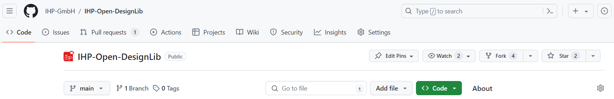
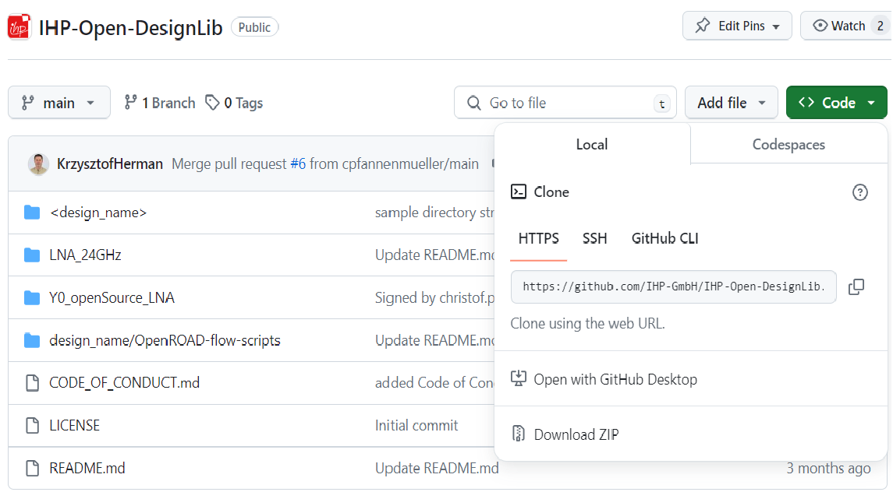
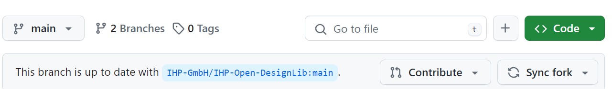

Submission process using github pull requests
=============================================

The submission process takes place on the GitHub platform. Each OpenMPW run has a dedicated repository, named with the prefix **TO_"** 
followed by a suffix indicating the month and year of the tape-out.

In order to submit a new design you should follow the typical github based flow shown on the figure below.

1. Forking the example **TO_Apr2025** repository

Go to the **TO_Apr2025** repository. You can do this by searching for the repository or by directly entering the URL in your browser.
https://github.com/IHP-GmbH/TO_Apr2025
On the top-right corner of the repository page, you will see a ``Fork`` button. Click on this button.

After this step a confirmation window should appear, where you should press ``Create fork`` button.

2. Clone the forked repository:

Now that you have your own copy of the repository, you might want to work on it locally, on your own PC. To do this, click on the green ``Code`` button and copy the HTTPS or SSH URL.
Then in your terminal line write 

.. code-block:: console

  git clone https://github.com/IHP-GmbH/TO_Apr2025.git

The repository will be downloaded to the ``TO_Apr2025`` directory where you can step in using ``cd TO_Apr2025``.

Now you are ready to do your own development following the instructions provided in the README file. 

Any time you want to see which files have been modified, added, or deleted, run:

.. code-block:: console

  git status
  
After adding, modifying or removing files you have to add and commit respective changes using ``git add/rm file`` commands and then  

.. code-block:: console

  git commit -s -m "Message of the commit"

The ``-s`` flag signs the commit what is a requirement to do pull request. 

3. Submitting the design using Pull request mechanism

If you forked the repository to contribute changes, you typically create a pull request on GitHub web interface. 

After pushing changes, visit your fork on GitHub, and GitHub will usually provide a prompt to create a pull request.

You can access the pull request feature using the contribution button

The pull request mechanism will synchronize your files with the IHP principal repsository.

  .. autosummary::
   :toctree: generated
